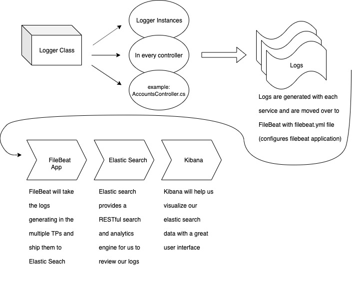

# Logging with Kibana and Elastic Search through C# MVC Pattern

#### Components and Usage
> - Logger class in code base
> - [FileBeat application](https://www.elastic.co/products/beats/filebeat)
> - ElasticSearch
> - Kibana

### Requirments
 - Docker (Within docker we will have ES and Kibana, using 6.2.4)
 - ASP.NET (using 2.1)

1. Run `docker-compose up -d` 
    (if you're running this for the first time, docker will be downloading the two images defined in docker-compose.yml from the docker registry)
2. Check `http://localhost:9200` thats the port where elastic search will be defined to be
3. check `http://localhost:5601` thats the port for kibana

4. We also require the following packages:\
    `dotnet add package Serilog`\
    `dotnet add package Serilog.Sinks.ElasticSearch`\
    `dotnet add package Serilog.Extensions.Logging`\
    `dotnet restore`
